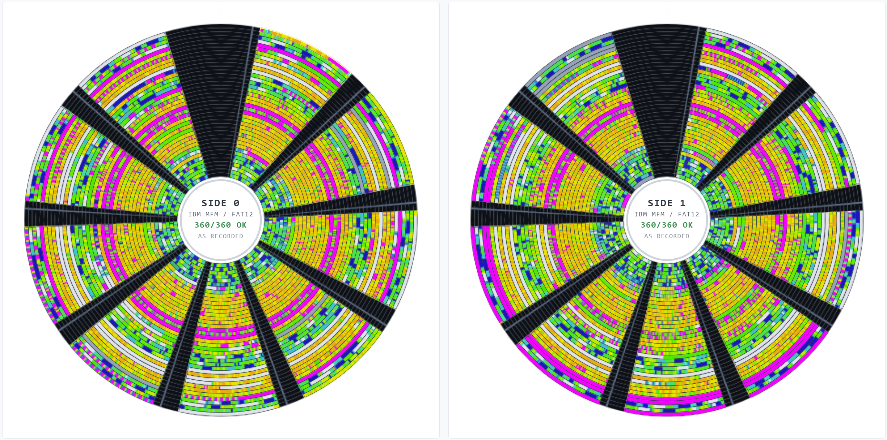
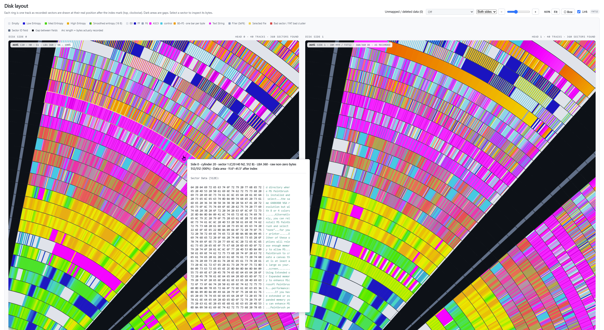
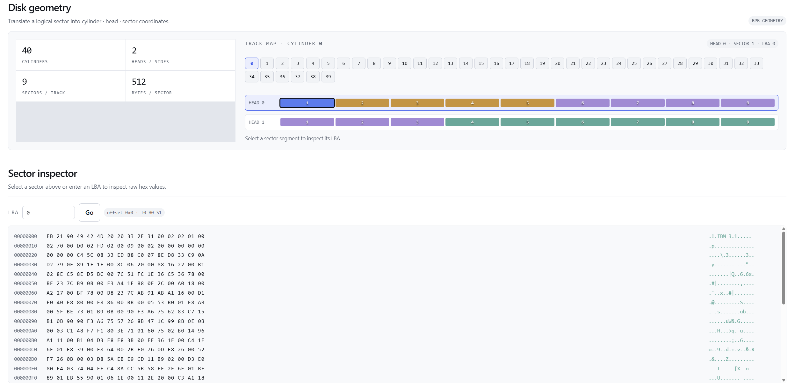
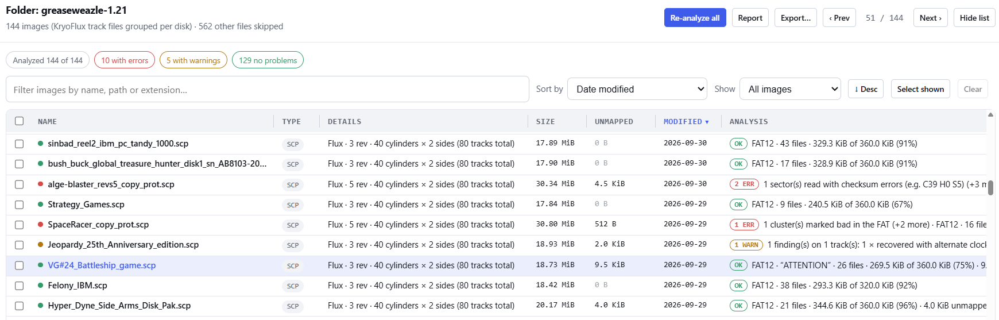
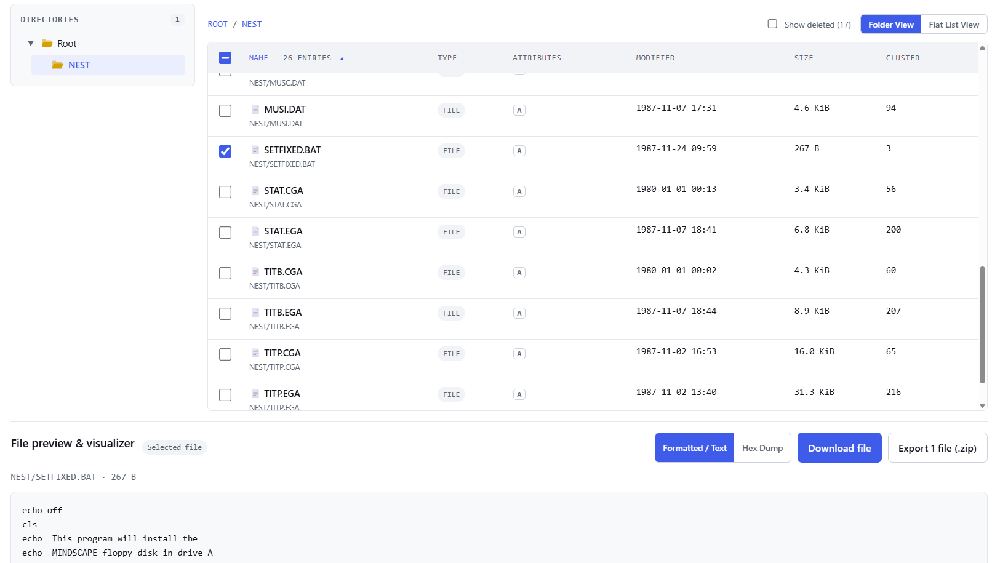
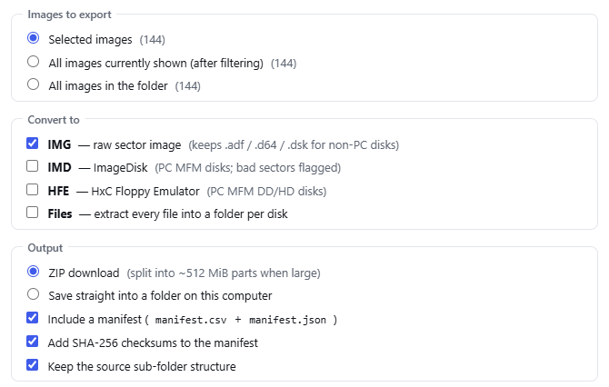
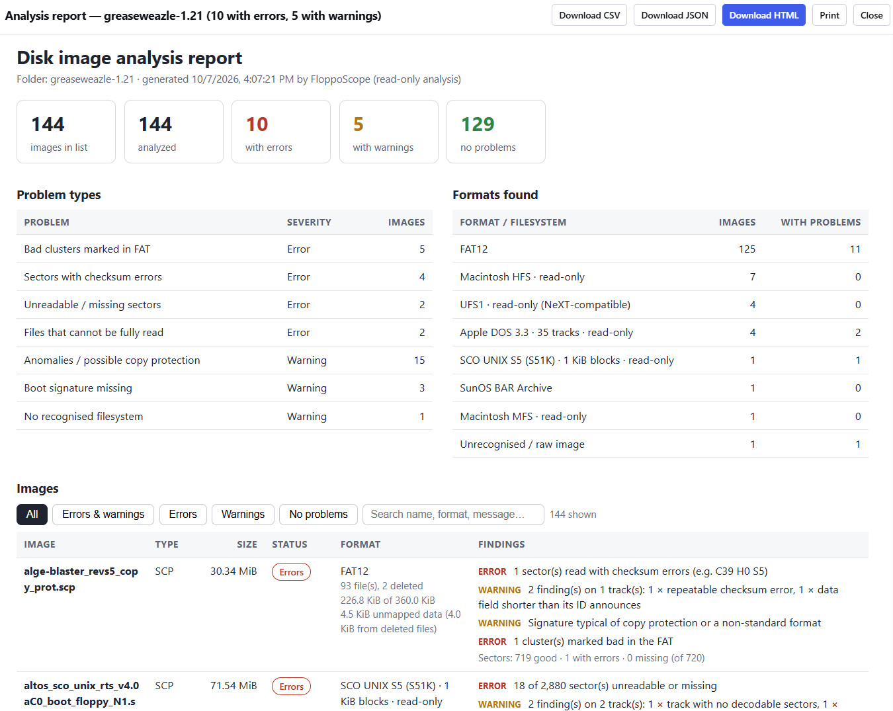
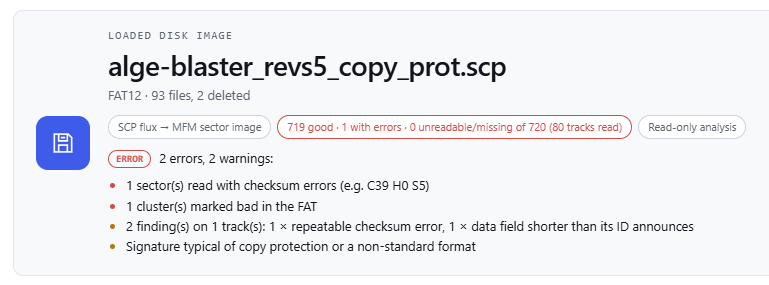

# FloppoScope

**See what's on the disk.** FloppoScope is a single-file, browser-based analyzer for floppy disk images. Open an image (or a whole folder of them) to inspect the boot record, allocation tables, directory tree and raw sectors, without mounting anything.

Everything runs locally in your browser. Nothing is uploaded, and your images are never modified.

**Try it:** https://0ldstaph.github.io/FloppoScope/

Or download `index.html` and open it in any modern browser. No server, install or build step is needed.

## Features

* **Disk layout map.** Every sector is drawn on a per-side disk view, with zoom, pan, box zoom and single-side mode. Select a sector to see its bytes in a hex view and its cylinder/head/sector position.

  

* **Image library.** Open a folder to scan many images at once, with filtering, sorting, export and a library report.

* **Filesystem browsing.** Browse the file tree, preview files, inspect FAT cluster chains and the boot-code inspector, and export selected files as a ZIP.
  

* **Bulk conversion.** Convert images to IMG, IMD or HFE, or extract all files into one folder per disk. Output goes to ZIP or straight to a folder, with an optional manifest and SHA-256 checksums.

  

* **Reports.** Export an analysis report for the open image or for a whole library.

  

  
* **Flux and container decoding.** Reads KryoFlux streams, SCP, HFE, IMD, TD0, WOZ, NIB, G64 and similar containers, and rebuilds sector images from them.

  

* **Unmapped and deleted data.** Finds non-blank sectors that no live file or folder owns, separates deleted-file remnants from other unmapped data, and lets you step through them and export them.

## Supported formats

| Area | Details |
| --- | --- |
| Filesystems | FAT12/16/32 (PC), Amiga OFS/FFS, Apple DOS 3.3 and ProDOS, Macintosh, Commodore (D64 and relatives), Atari DOS, ZX Spectrum TR-DOS, BBC Micro DFS, SysV and SCO UNIX, NeXTSTEP UFS |
| Image and flux files | .img .ima .dsk .bin .d64 .d71 .d81 .adf .atr .xfd .st .msa .po .do .2mg .hdv .trd .ssd .dsd .msx .mdi .woz .nib .g64 .dms .ipf .hfe .scp .raw .imd .td0 .fdi |

Support depends on what the image actually contains, so some images may only be partly decoded. The unmapped-data scan applies to FAT sector images only.
